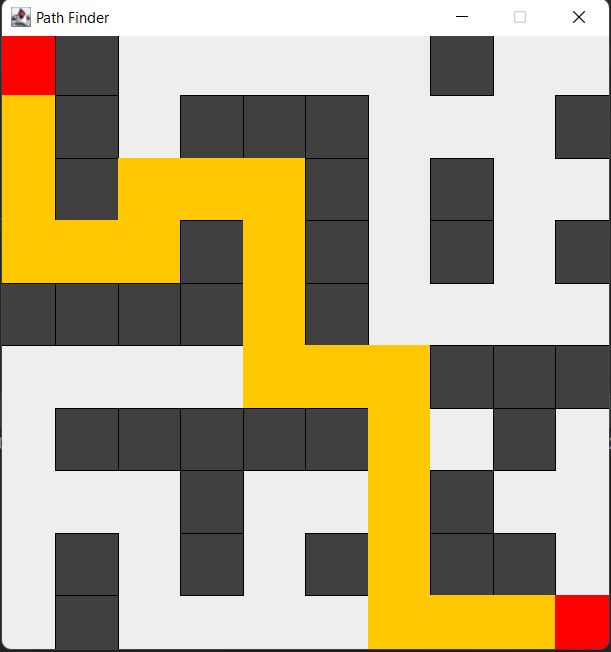

# Path Finder

This is a Java Swing application. It gets user inputs from keyboard and mouse to determine source and destination points over a grid area. Then it calculates the shortest path and displays on GUI.

## Dependencies for Running Locally
* Java Development Kit (OpenJDK) >= 18.0.1.1
    * All OSes: [click here for installation instructions](https://openjdk.java.net/install/)

## Basic Build Instructions

1. Clone this repo.
2. Make a build directory in the top level directory: `mkdir out`
3. Copy sources files into output directory: `cp src/*.java out`
4. Go to output directory and compile: `cd out`
5. Compile: `javac *.java && jar cfe App.jar Main *.class` 
6. Run it: `java -jar App.jar`.

